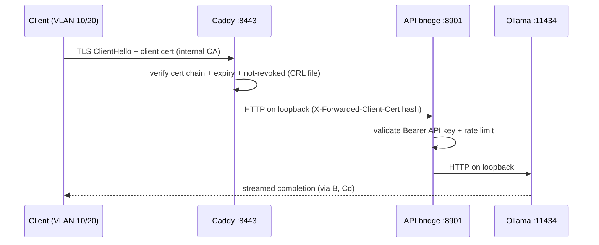

# Network Topology

Last verified: 2026-08-04 · Owner: platform-eng · Approver: security

## VLAN layout

| VLAN | Name | Subnet | Purpose |
|---|---|---|---|
| 10 | corp-lan | 10.10.0.0/22 | Workstations, internal apps |
| 20 | corp-servers | 10.20.0.0/24 | Internal services (consumers of LLM API) |
| 40 | llm-api | 10.40.10.0/24 | LLM serving segment (llm-prod-lt01) |
| 90 | oob-mgmt | 10.90.0.0/24 | Out-of-band/IPMI, jump host only |

**llm-prod-lt01**: `10.40.10.21/24`, gateway `10.40.10.1`.

## Firewall zones & rules (UFW on host, perimeter on gateway)

Host policy (managed by `infra/playbooks/01-os-hardening.yml`):

- **INPUT**: default deny. Allowed: `22/tcp` from `10.90.0.0/24` (jump host
  only), `8443/tcp` from `10.10.0.0/22` and `10.20.0.0/24`, Netdata
  `19999/tcp` from the monitoring collector only.
- **OUTPUT**: default **deny**. Allowed: loopback, established/related,
  `53/udp` to internal resolver `10.20.0.5`, `123/udp` to internal NTP
  `10.20.0.6`. **Everything else — including all internet egress — is
  dropped and logged.** App profile: `config/ufw/applications.d/ollama-server`.
- Asserted continuously by `tests/security/test_egress_blocking.sh`
  (attempts resolution/connectivity to known telemetry endpoints and
  requires failure).

Perimeter (gateway, owned by network team): no NAT, no port-forward to
VLAN 40; inter-VLAN ACL allows only 8443/tcp inbound to `10.40.10.21`.

## mTLS paths

- Server cert/key: `/etc/caddy/tls/llm-prod-lt01.{crt,key}` (never in git —
  see `deploy/caddy/tls/.gitignore`).
- Client CA pool: `/etc/caddy/tls/ca.crt`; CRL checked per
  `docs/04-operations/runbooks/certificate-rotation.md`.
- Loopback hops (Caddy→bridge→Ollama) are unencrypted by design: they never
  leave the kernel; host compromise supersedes transport security.

## Air-gap boundary

- No route from VLAN 40 to the internet exists at any layer.
- Model weights enter only through the air-gap kiosk procedure:
  [`../02-deployment/air-gap-procedure.md`](../02-deployment/air-gap-procedure.md).
- DNS for llm-prod-lt01 is internal-only; `llm.jol.internal` →
  `10.40.10.21`.

## Change control

Any firewall rule change requires: PR to `infra/` or `config/ufw/`, two
reviews (CODEOWNERS), and a post-change run of
`tests/security/test_egress_blocking.sh` + `network-isolation-test.sh`.
