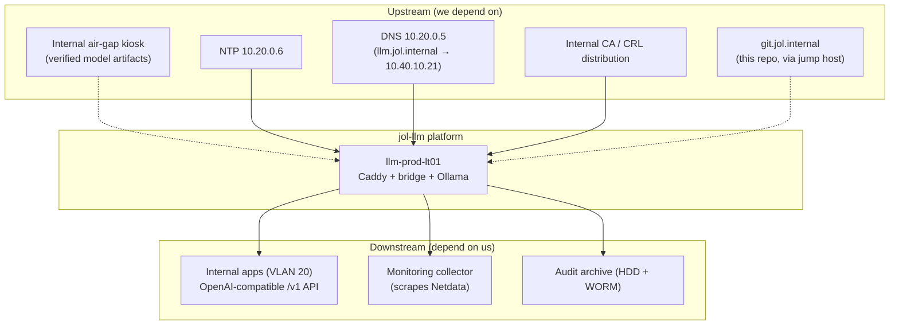

# Service Dependencies

Last verified: 2026-08-04 · Owner: platform-eng

## Contract overview

## Upstream contracts

| Dependency | Protocol | Failure impact | Degraded-mode behavior |
|---|---|---|---|
| Air-gap kiosk | USB/NAS, manual | No new models | Service continues with resident models indefinitely |
| NTP | 123/udp | Clock drift → cert/TLS & log-ordering issues | systemd-timesyncd holdover; alert after 500 ms drift |
| DNS | 53/udp | Clients can't resolve `llm.jol.internal` | Clients may use `10.40.10.21` directly (documented) |
| Internal CA | File/CRL | Revocation checks stale | Caddy caches CRL; alert at 7 days to expiry (cert runbook) |
| Git origin | SSH via jump host | No updates | Host is config-frozen; updates are never live-required |

**The platform has zero hard runtime dependencies.** Once deployed, it can
serve indefinitely with no external contact — this is by design (air-gap).

## Downstream contracts (what we promise)

| Property | Commitment | Mechanism |
|---|---|---|
| API shape | OpenAI-compatible `POST /v1/chat/completions` (subset) | [`../06-api/openapi-spec.yaml`](../06-api/openapi-spec.yaml); breaking change = MAJOR version |
| Availability | Best-effort on single host; no SLA tier above "internal tool" | Rollback + model-swap runbooks keep RTO < 30 min |
| Latency | Median TTFT < 5 s for ≤512-token prompts on resident model | Enforced by `tests/integration/test_model_inference.sh` |
| AuthN | mTLS + Bearer API key; per-client keys | `docs/06-api/authentication.md`; rotation script |
| Rate limits | Per-client token bucket, 429 with `Retry-After` | `docs/06-api/rate-limiting.md` |
| Privacy | 0-day prompt retention; metadata-only audit | Data retention policy + CI-asserted log hygiene test |
| Versioning | Semver tags; CHANGELOG | Root `CHANGELOG.md` |

## Consumer onboarding checklist

1. Consumer requests client cert (team scope) + API key via internal form.
2. Platform lead issues key (`scripts/security/rotate-api-keys.sh --new`).
3. Consumer integrates against staging (`llm-stg-01`), passes contract test.
4. Key promoted to production; usage visible in audit dashboard (by hashed
   client ID only).

## Decommissioning notes

Decommission of a downstream consumer = revoke key + cert (CRL), no service
restart needed. Decommission of the platform itself requires data-sanitization
per `security/policies/data-retention-policy.md` §7 (crypto-erase NVMe,
degauss/wipe HDD archive).
