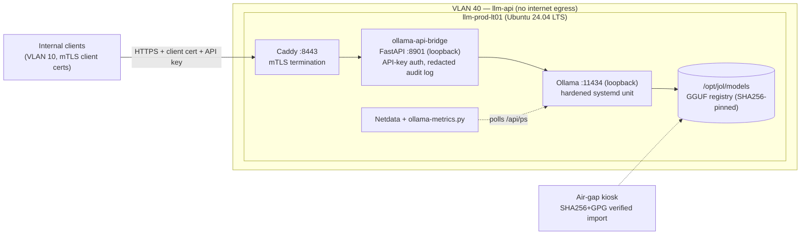

# System Overview

Last verified: 2026-08-04 on llm-prod-lt01 · Owner: platform-eng

## Purpose

Serve LLM inference to internal JOL clients with **no external data flow**,
strong authentication, and zero persistence of prompt content.

## Component diagram

## Request data flow

1. Client in VLAN 10 opens TLS to `10.40.10.21:8443`. Caddy requires a
   valid client certificate signed by the internal CA (see
   `deploy/caddy/tls/README.md`). Unauthenticated clients are rejected at
   the TLS layer.
2. Caddy forwards (HTTP, loopback) to the **API bridge** on `127.0.0.1:8901`.
   The bridge validates the `Authorization: Bearer <api-key>` against the
   hashed key store, applies per-client rate limits, and attaches a
   correlation ID.
3. The bridge proxies to **Ollama** on `127.0.0.1:11434`, mapping the
   OpenAI-compatible `/v1/chat/completions` onto Ollama's native API.
4. Ollama loads the resident model (Qwen3-32B Q8_0, ~34 GiB) from
   `/opt/jol/models` and performs CPU inference on the 3950X.
5. The response streams back through the bridge and Caddy. **No hop writes
   request/response bodies to disk.** The bridge writes one audit record per
   request: timestamp, correlation ID, hashed client ID, model, token
   counts, latency, status code — never content.

## Design decisions

| Decision | Rationale |
|---|---|
| CPU inference | Polaris GPU lacks ROCm support for LLM workloads; 96 GB RAM + 32 threads gives usable tok/sec for 32B Q8 (see benchmarks). GPU upgrade tracked in `02-deployment/gpu-upgrade-roadmap.md`. |
| Bridge in front of Ollama | Ollama has no native API-key auth or audit logging; adding it out-of-band keeps Ollama stock and updatable. |
| Single loaded model (`OLLAMA_MAX_LOADED_MODELS=1`) | 96 GB RAM cannot host 32B Q8 plus a second large model with KV cache headroom; swap runbook covers model changes. |
| mTLS **and** API keys | Defense in depth: certs authenticate machines/teams, keys authenticate workloads; either can be revoked independently. |
| No internet egress | Eliminates telemetry/exfiltration class entirely; model updates are deliberate, verified, air-gapped events. |

## Failure behavior

- Ollama crash → systemd `Restart=on-failure` (5 s backoff); in-flight
  requests fail fast, bridge returns 502.
- Bridge down → Caddy returns 502; Ollama unaffected (can be used for
  local diagnostics via loopback only).
- Model file corruption → startup fails integrity check (manifest
  SHA256 re-verification available in `scripts/maintenance/health-check.sh
  --verify-model`); follow `runbooks/incident-response.md` §3.

## See also

- Network detail: [network-topology](network-topology.md)
- Contracts: [service-dependencies](service-dependencies.md)
- Threat model: [../03-security/threat-model.md](../03-security/threat-model.md)
