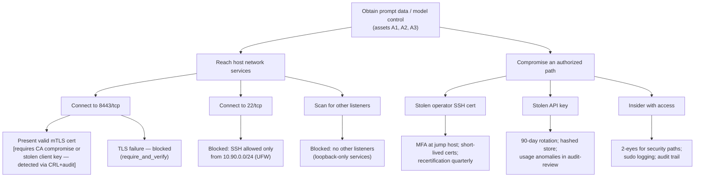

# Attack tree — lateral movement to the LLM host

Goal: attacker on corp VLAN obtains prompt data or model control.

## Cut sets (minimal successful paths)

1. **CA key compromise + forged client cert** — mitigated: CA key offline,
   0400, access logged; detection: unexpected issuance events.
2. **Leaked API key + valid client cert** — mitigated: rotation cadence,
   revocation ≤ minutes; detection: hashed-ID usage review.
3. **Insider with sudo** — mitigated: command logging, 2-eyes change
   control; accepted residual risk recorded in STRIDE register.

## Metrics

- Time-to-detect target for any cut-set activation: ≤ 24 h (weekly audit
  review + Netdata anomalies).
- Time-to-contain: key/cert revocation ≤ 4 h (SLA).
