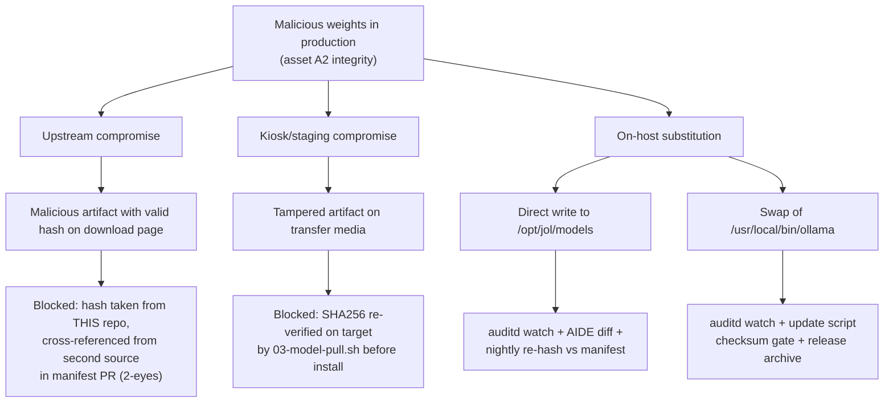

# Attack tree — model supply chain compromise

Goal: attacker substitutes or modifies model weights served to users.

## Cut sets

1. Upstream + both checksum sources compromised simultaneously — residual
   risk T3 (accepted, annual review).
2. Root on host bypassing monitoring — mitigated by immutable audit rules
   (`-e 2`) + off-host archive of audit trail; detection via WORM-archive
   reconciliation.
